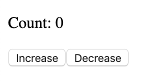
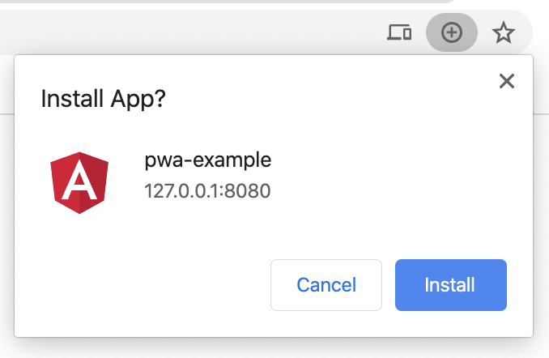
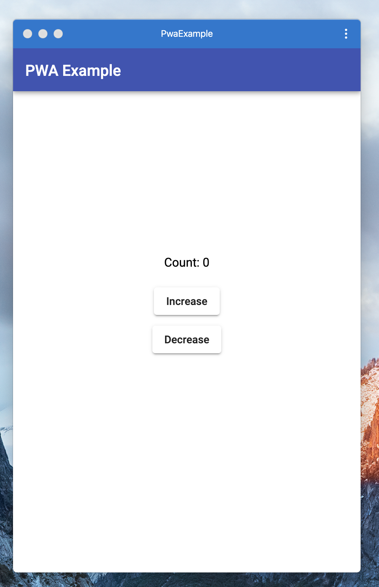

= Developing Progressive Web Apps with Angular
Andreas HAESSLER <hae17487@spengergasse.at>
v0.3, 2020-01-12
:example-caption!:
:media: prepress
:icons: font

ifdef::backend-pdf[:imagesoutdir: ../../../build/asciidoc/{backend}/images]
ifdef::backend-pdf[:imagesdir: ../../../build/asciidoc/{backend}/images]

:toc:

== Abstract

The application landscape is changing. Today, the majority of the population is using mobile phones to access applications and websites. When developing a web application, responsive design is among the first things web developers consider. What they are often missing, though, is that developing a mobile-optimized web app involves much more than just making sure the layout looks correct.

For a truly great user experience, web apps need to be reliable, fast and engaging. They need to deal with network connectivity issues, while also being smooth on low-end devices and feeling like a native app to the user. This guide will explain how to develop a PWA providing a native-app-like experience using the Angular framework.

<<<

== Introduction

For starters, what even is a progressive web app? What differentiates it from a normal web app? Google has defined four adjectives that need to be applied to make an ordinary single-page application a progressive web app:

=== Fast

When considering load times, every second counts. 53% of users will leave a site if it takes longer than 3 seconds to load. When the app finished loading, it should have smooth scrolling and jitter-free animations.

=== Reliable

As mobile phones rely on oftentimes unstable wireless connections, network failures are inevitable. Users may still want to access your application, even when they are at remote locations without network coverage.

=== Engaging

If users like your product, they might want to use it again after some time. But always having to open the browser and search for it is not ideal, especially if it is accessed very often. PWAs provide a way to install themselves onto the user's device and add it to their home screen, so it is always just one tap away.

Progressive Web Apps can be built using plain HTML/CSS and Javascript, that approach doesn't scale very well. Luckily, the Javascript ecosystem offers more frontend frameworks than I can count. We will be using Angular, because it is quite mature and common these days.

<<<

== Getting started with Angular

Angular is one of the most prevalent Javascript frontend frameworks used today. It is developed by Google and backed by many large companies. At the time of writing, the most recent version is Angular 8.

The easiest way to get started is to install the Angular CLI globally using npm:

 npm install @angular/cli -g

NOTE: If you do not have node.js or npm installed yet, you can get them from https://nodejs.org/en/[the official website] or using the package manager of your choice.

You use the CLI with the `ng` command. You will need it very often. For now you can use it to generate your first Angular project:

 ng new

After executing, you will be asked for a name. I chose the name 'pwa-example'. The next question is about adding Angular Routing to the project. This is recommended for larger projects containing different pages, but for our example, you can choose 'no'.

The last question is about which CSS preprocessor you want to use. It is recommended that you use one in large projects, but which one depends largely on personal preference. SCSS is the industry standard, some savage people enjoy the freedom of Stylus. For simplicity's sake, I will use plain CSS without preprocessing.

Now, sit back and relax while the magic of Angular CLI downloads all dependencies and sets up your project structure. Depending on your internet connection and device, this might take a little while.

NOTE: An advantage of Angular that you'll notice here is its opinionated fashion. Instead of having to fiddle with Javascript build tools for hours, you can use the Angular CLI project generator and jump right in.

Now that the generator has done its work, you should have a working skeleton project in front of you. The most important one is the `src` directory, containing all source files for your app. Inside of it, you will find some other files and folders:

- `app/`: This directory contains all components, pages and source files of your project.
- `assets/`: This directory would contain static assets like fonts or images. Because the project just got generated, it is empty, except for a `.gitkeep` file, keeping the directory checked into version control.
- `environments/`: This directory contains running configurations for your application. The default ones are `environment.ts` and `environment.prod.ts`. You will most likely not need to touch those for a long time.
- `index.html`: The index page of your application. By default, it just contains the `app-root` component defined in `app/`.
- `main.ts`: This is the file that makes your app run. It bootstraps your application module.
- `styles.css`: Global application styles. All other styles are component-specific.
- `polyfills.ts`: Polyfills for certain browser features required by Angular. You can add your own polyfills as well.
- `test.ts`: Initializes environment when running tests.

NOTE: Angular is so nice, it even sets up a Git repository for you without asking! How courteous!

One thing you might have noticed is that there are no Javascript files in the project. That's because Angular uses Typescript, which is basically Javascript with a mostly sane type system. It will save you hours of "cannot read x of undefined" and related errors. The cool thing is that it's trivial to learn, especially if you have experience in both Javascript and any statically typed language like Java. You can literally learn it in 5 minutes using http://www.typescriptlang.org/docs/handbook/typescript-in-5-minutes.html[the official guide].

== Writing an Angular-powered single page application

The first thing there is to understand about Angular is how exactly it's going to make your life easier. In the modern web, applications are more than just some paragraphs of text with static HTML forms in between. In fact, some application structures are so complex that it's next to impossible to model them the plain old HTML/CSS + JS way. Files get big, logical flows get convoluted and developers get confused. There needs to be some structure.

The most sensible thing to do is to break your application into smaller, manageable parts. Angular achieves this divide-and-conquer strategy in multiple ways, but the most important one is its component system. Technically, you _could_ write your whole application into one big app.component, but then you don't need Angular. The most practical approach is to break up your application into pages and reusable components. For example, you might have a specific form you need multiple times, or it could just be a button with special styling. Each of those components is self-contained and can manage its own internal state, which enables you to encapsulate implementation details. This really pays off in large enterprise applications where thousands of different components and pages are needed.

If you open the `app` directory in your generated project, you will see your first Angular component. It consists of 4 different files:

- `app.component.html`: The HTML template that represents your component
- `app.component.ts`: The code that powers it
- `app.component.spec.ts`: Automated unit tests
- `app.component.css`: CSS styling

You can ignore the 5th file (`app.module.ts`) for now.

NOTE: Having four different files for one component is often seen as bloated or convoluted by developers coming from frameworks like Vue.js or React. Angular developers defend themselves by saying it helps to separate concerns.

If you open the HTML template file, you will see plain old HTML. Upon taking a closer look, you will notice that Angular has enhanced its flavor of HTML with some special features called _directives_. These are special HTML attributes defined by Angular (or some library, or even yourself!) that change the behavior of your view. For example, you can replace the whole file with this:

.app.component.html
[source,angular2html]
----

Count: {{count}}
 // <1>
<button (click)="increment()">Increase</button> // <2>
<button (click)="decrement()">Decrease</button> // <2>
----
<1> The `{{count}}` tells Angular to insert the value of `count` defined in the component's source file.
<2> The `(click)="..."` tells Angular to bind `click` events to the specified function calls.

Now replace the contents of `app.component.ts` with the following:

.app.component.ts
[source,typescript]
----
import { Component } from '@angular/core';

@Component({ // <1>
  selector: 'app-root', // <2>
  templateUrl: './app.component.html', // <3>
  styleUrls: ['./app.component.css'] // <3>
})
export class AppComponent {
  count: number = 0; // <4>

  increment() {
    this.count++;
  }

  decrement() {
    this.count--;
  }
}
----
<1> The `@Component` decorator marks this class as an Angular component.
<2> The `selector` attribute defines the name of the component in HTML templates. This means if you want to reuse this component somewhere else (like we are doing in `index.html`) then you need to refer to it as `<app-root></app-root>`.
<3> `templateUrl` and `styleUrls` tell Angular where to find the HTML template and CSS styling files.
<4> The class itself contains a field `count` with the type `number` and methods to increment or decrement it. These methods are called in the `click` event bindings defined in the HTML template.

Now you can run the Angular development server to access your application with the command `ng serve` or short `ng s`. The first line of output will show a URL along the lines of `The project is running at http://localhost:4200/webpack-dev-server/`. Follow that link to reach your application:

A counter, how lovely! And the "Increase" and "Decrease" buttons are working too! That's because you bound the content of the `
` tag to the `count` variable defined in your component, so if the variable gets changed, the view automatically updates.

== Implementing PWA features using Angular

Now that you have implemented your first Angular application, you can focus on making it a Progressive Web App. Luckily for you, making your Angular application a PWA is as easy as a single command:

 ng add @angular/pwa

This command automatically adds numerous web features to your app.

=== Offline first

The most important feature of a PWA is that it's available offline. Your application is actually offline-only, as it's just a counter in the local application memory. All we have to do now is ensure that our website loads even if the user is offline.

_Wait, what?!_

Yes, you read that right. We need our dynamically loaded web application to be available without fetching it from the CMS server. Just a few years ago, this sounded next to impossible. Luckily, modern web technologies allow us to cache the site content on the client so he or she only needs to fetch the application once. The specific technology is called _Service workers_.

<<<

To quote the official https://angular.io/guide/service-worker-intro[Angular documentation on service workers]:

[quote]
Service workers augment the traditional web deployment model and empower applications to deliver a user experience with the reliability and performance on par with natively-installed code.

A service worker has been added to your application with a default caching configuration. You can test it by accessing your web app and then simulating offline-mode using Chrome's DevTools.

=== Installability

Now that our web app is available offline, we may not want our users to always enter our URL to access the app. Obviously, it seems really counterintuitive to try visiting a website while being offline. The solution is to 'install' our app to the user's device. We don't really install anything to the user's device - that's what the service worker is already taking care of - but we place an icon to the user's homescreen to instantly visit our website.

For this we need a _Web Manifest_ file. Luckily, our handy Angular command already generated one for us at `src/manifest.webmanifest`. It is a JSON file containing some metadata about our app like names, URLs and icons.

Most of the properties are self-explanatory. One of the more specific configuration options is the `display` property. It controls the appearance of your app when opened by the user. The following options are available:

- `fullscreen`: Opens the app like a native fullscreen app, taking up the entire display
- `standalone`: Opens the app like an ordinary native app, still showing the notification bar but hiding browser controls like the address bar
- `minimal-ui`: Like `fullscreen` but still shows on-screen navigation buttons. _Only supported by Chrome for Mobile._
- `browser`: Acts like a bookmark, opens a browser tab normally

So the neat thing is that we can make our browser app indistinguishable from native apps, which gives it a more integrated look and feel.

== Testing our app

If we want to include our shiny service worker, testing becomes a bit more tricky because the regular Angular dev server does not support this use case. That means we need to build our app and serve it from the `dist/` folder. To build the app in production mode (including service worker, optimization etc.), use this command:

 ng build --prod

Your app has now been compiled to some optimized Javascript bundles, assets and an `index.html` file. The contents of the compiled are located at `dist/pwa-example/`. Now, we need a simple HTTP server to serve the files from this directory. You can for example use the Python `http.server` module for that, by running this command from the `dist/pwa-example/` folder:

 python -m http.server

If you do not have Python installed, you can install the `http-server` module from NPM and use it:

 npm i -g http.server
 http-server dist/pwa-example -o

The last command will start a server in the specified directory and open a browser window.

If you did everything correctly, you should get an installation prompt in your browser:

When clicking 'Install', the app will be installed to your local machine and you can access it like any native app:

== Summary

In conclusion, Progressive Web App technologies are a great way to give your users a native-app-like experience while in reality you are just recycling the web app you already have. This guide has shown you:

- The abstract concepts of Progressive Web Apps
- Basics of the Angular framework
- Using Angular features in order to build PWAs
- How Service Workers make your app available offline
- How Web Manifests make your app appear like a native app

=== Possible improvements

Of course, for the sake of simplicity, the example given in this guide is extremely basic and will not suffice to deliver your users a truly great PWA experience. A large step into the right direction would be adding proper UI elements instead of using the native ones provided by the browser.

The https://material.angular.io/[Angular Material] library provides lots of UI controls following Google's https://material.io/[Material Design] guidelines. Integrating it into your app means that UI elements will appear consistently when compared to native Android apps, so it really adds to the native look and feel.

<<<

== Resources

The source code of the example app is available in this guide's https://github.com/AndreasHae/technical-paper[Github repository] under the folder `pwa-example`.

.Sources
[cols="40,20,40", options="header"]
|===
| URL
| Date
| Remarks

| https://developers.google.com/web/progressive-web-apps[Google Developers]
| 2019-12-19
| High-level overview about PWAs

| https://developer.mozilla.org/en-US/docs/Web/Progressive_web_apps[MDN]
| 2019-12-19
| High-level overview and further reading
|===
